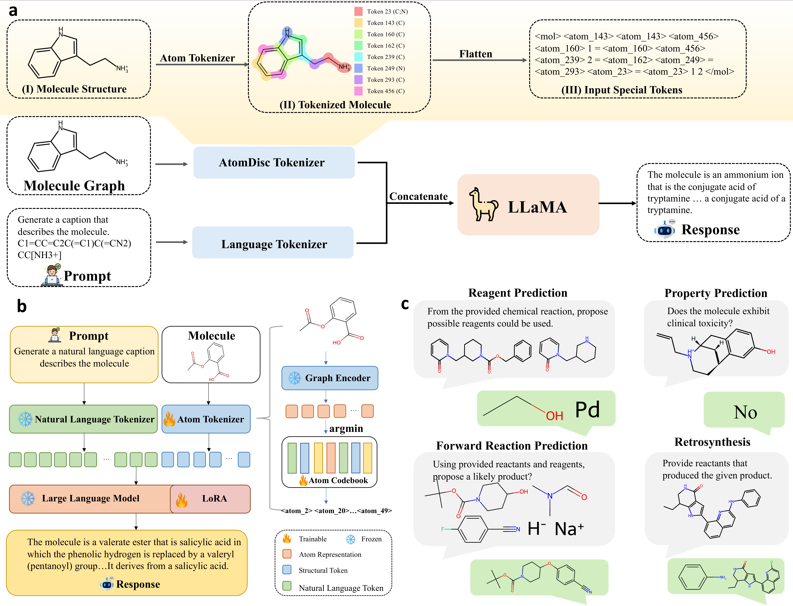

# AtomDisc

AtomDisc is a four-stage training framework that fuses graph-based molecular representations with large language models (LLMs). Stage 1 trains a GNN+VQ codebook, Stage 2 aligns codebook embeddings with the LLM, Stage 3 performs multi-task LoRA pre-training, and Stage 4 applies supervised fine-tuning to downstream property and reaction tasks. All scripts now rely on relative or empty paths so that experiment-specific locations can be supplied at runtime.

## Figure 1 Overview



[Download high-resolution PDF](fig/Figure1_new.pdf)

Figure 1 summarizes the workflow:
- **(a) AtomDisc Tokenizer**: a molecular graph is encoded and assigned context-aware atom codes, turning each atom into a token that reflects its chemical environment.
- **(b) AtomDisc-LLM Integration**: graph embeddings are discretized into atom-level tokens, concatenated with natural-language tokens, and processed jointly by the LLM.
- **(c) Downstream Tasks**: the unified representation supports reagent prediction, property prediction, forward reaction prediction, and retrosynthesis.

## Repository Layout

- `scripts/`
  - `train_codebook.py`: Stage 1, train the GNN plus VQ codebook.
  - `train_embedding.py`: Stage 2, align VQ embeddings with the base LLM.
  - `pretrain_lora.py`: Stage 3, multi-task LoRA pre-training across reaction and caption datasets.
  - `sft_property_classification.py`: Stage 4, property classification (multi-dataset, multi-seed).
  - `sft_property_regression.py`: Stage 4, property regression (QM9).
  - `sft_forward_prediction.py`: Stage 4, forward reaction prediction.
  - `sft_retrosynthesis.py`: Stage 4, retrosynthesis prediction.
  - `sft_reagent_prediction.py`: Stage 4, reagent recommendation.
- `atomdisc/`
  - `config/`: configuration dataclasses, e.g. `stage1.py` for `Stage1Config`.
  - `core/`: shared low-level utilities (e.g. `mol_encoder`).
  - `datasets/`: dataset wrappers and collators for each task.
  - `evaluation/`: evaluation helpers such as `sft_evaluator_smiles`.
  - `metrics/`: SMILES-level metric implementations.
  - `models/`: neural network modules (GNN, projector, etc.).
  - `tokenization/`: SMILES processing and atom-level tokenization.
  - `utils/`: logging, seeding, and GNN/VQ loading utilities.
- `fig/`: figures for documentation (e.g. `Figure1_new.pdf`).

## Environment Setup

1. Create the Conda environment (mirrors the original `cs224n` setup):
   ```bash
   conda env create -f environment.yml
   conda activate atomdisc
   ```
2. Install AtomDisc in editable mode:
   ```bash
   pip install -e .
   # optional development extras
   pip install -e .[dev]
   ```
3. Alternatively, for pure pip workflows install dependencies via:
   ```bash
   pip install -r requirements.txt
   ```

## Key Arguments

All path-like arguments default to empty strings (or relative placeholders). Provide explicit values when running scripts.

| Argument | Scripts | Description |
| --- | --- | --- |
| `--train_smiles_path` | `train_codebook.py` | Stage 1 SMILES training file. |
| `--sft_data_path` | Stage 2 & Stage 4 scripts | SFT-formatted JSON/JSONL dataset. |
| `--stage1_gnn_vq_checkpoint_path` | Stage 2/3/4 | Trained GNN+VQ checkpoint (`.pth`). |
| `--stage2_model_path` | Stage 3/4 | Stage 2 output directory containing the projector-aligned LLM. |
| `--base_tokenizer_path` | Stage 2/4 | Base LLM tokenizer directory (required if `stage2_model_path` is empty). |
| `--base_llm_model_path` | Stage 2/4 | Base LLM weights directory. |
| `--stage3_lora_adapter_path` | Stage 4 | LoRA adapters from Stage 3 multi-task pre-training. |
| `--caption_guided_data` / `--forward_pred_data` / `--reagent_pred_data` / `--retrosynthesis_data` | `pretrain_lora.py` | Stage 3 datasets for each task. |
| `--dataset_root` | `sft_property_classification.py`, `sft_property_regression.py` | Root directory for property datasets. |
| `--output_dir` | All scripts | Output directory for checkpoints and logs. |

Non-path hyperparameters (learning rate, batch size, LoRA rank, seeds, etc.) remain unchanged from the original codebase and can be overridden as needed.

## Typical Workflow

1. **Stage 1 – Train GNN + VQ**
   ```bash
   python scripts/train_codebook.py \
     --train_smiles_path path/to/smiles.txt \
     --output_dir ./stage1_output
   ```

2. **Stage 2 – Train Projector and Bake Embeddings**
   ```bash
   python scripts/train_embedding.py \
     --stage1_gnn_vq_checkpoint_path ./stage1_output/gnn_vq.pth \
     --sft_data_path path/to/sft.json \
     --base_tokenizer_path path/to/base_tokenizer \
     --base_llm_model_path path/to/base_llm \
     --output_dir ./stage2_model
   ```

3. **Stage 3 – Multi-task LoRA Pre-training (optional)**
   ```bash
   python scripts/pretrain_lora.py \
     --stage1_gnn_vq_checkpoint_path ./stage1_output/gnn_vq.pth \
     --stage2_model_path ./stage2_model \
     --caption_guided_data path/to/caption.json \
     --forward_pred_data path/to/forward.json \
     --reagent_pred_data path/to/reagent.json \
     --retrosynthesis_data path/to/retro.json \
     --output_dir ./stage3_lora
   ```

4. **Stage 4 – Downstream Fine-tuning (examples)**
   ```bash
   python scripts/sft_property_classification.py \
     --dataset_root path/to/property_dataset \
     --stage1_gnn_vq_checkpoint_path ./stage1_output/gnn_vq.pth \
     --stage2_model_path ./stage2_model \
     --output_dir ./stage4_property

   python scripts/sft_forward_prediction.py \
     --sft_data_path path/to/forward.json \
     --stage1_gnn_vq_checkpoint_path ./stage1_output/gnn_vq.pth \
     --stage3_lora_adapter_path ./stage3_lora/multitask_lora_epoch_X \
     --output_dir ./stage4_forward
   ```

The remaining scripts (`sft_retrosynthesis.py`, `sft_reagent_prediction.py`, `sft_property_regression.py`) follow the same pattern with task-specific datasets and outputs.

## Practical Notes

- Run scripts from the repository root or ensure the `atomdisc` package is on `PYTHONPATH`.
- RDKit and PyTorch Geometric have platform-specific builds; consult their documentation for GPU-enabled installation.
- LoRA stages require access to the base LLM weights and sufficient GPU memory.
- Always override the placeholder paths via CLI arguments; scripts validate inputs before training.

## License & Acknowledgements

AtomDisc is released under the MIT License (see `LICENSE`). The project builds upon open-source molecular modeling and LLM fine-tuning research; please open issues or pull requests for questions and improvements. 

